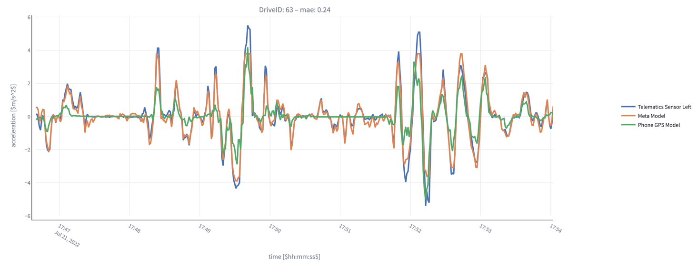
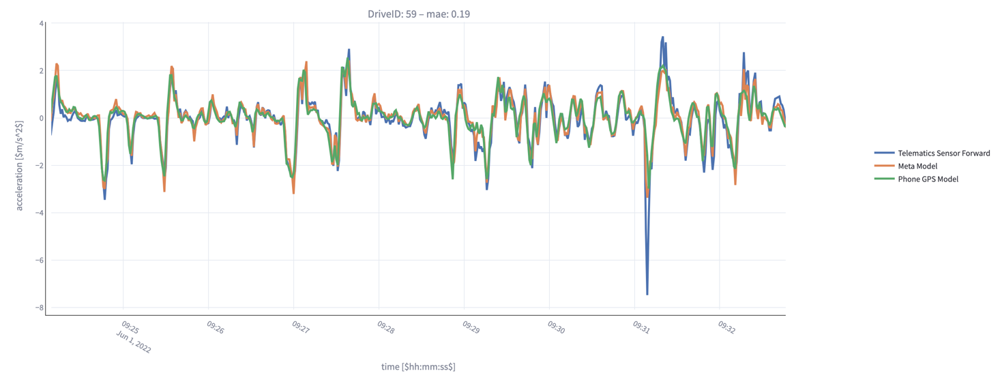

# Vehicle Acceleration Modelling

This project aims to predict vehicle acceleration in forward and left direction using GPS, Gyro and acceleration sensors from a smartphone. The entire process includes data preprocessing, model training, and prediction visualization.

Master 3. Semester





## Installation and Setup

1. **Clone the repository**:

2. **Setting up a virtual environment** (optional but recommended):

    multiple ways exist to do that, e.g. Python's build in `venv` module:
    ```
    python -m venv venv
    source venv/bin/activate  # On Windows use `venv\Scripts\activate`
    ```

3. **Install the dependencies**:
    ```
    pip install -r requirements.txt
    ```

## Directory Structure

```
├── meta_learner.ipynb
├── model
│   └── meta_learner.py
├── preprocessing
│   ├── preprocessing.py
│   └── preprocessing_utils.py
├── results
│   ├── short_trips_forward_90.pkl
│   ├── short_trips_left_90.pkl
│   ├── whole_trips_forward_90.pkl
│   └── whole_trips_left_90.pkl
└── streamlit
    ├── app.py
    └── streamlit_utils.py
```

## Components

### meta_learner.ipynb

This Jupyter notebook contains all the code related to feature creation and model training of the meta-learner.

### best_case.ipynb

This Jupyter notebook contains all the code related to training the different best case models.

### model

Contains scripts related to the meta learner model.

- **meta_learner.py**: Main script where the meta learner model is defined.

### preprocessing

Scripts in this directory are used for data preprocessing.

- **preprocessing.py**: Loads raw data from an SQL database.
- **preprocessing_utils.py**: Contains utility functions for feature creation.

### results

Stores the prediction results.

- **whole_trips_90_forward.pkl**: Contains predictions for forward trips.
- **whole_trips_90_left.pkl**: Contains predictions for left turns.

### streamlit

This directory houses the frontend application built with Streamlit for visualization of the predictions made by the model.

- **app.py**: Main Streamlit application.
- **streamlit_utils.py**: Utility functions for the Streamlit app.

- Navigate to the `streamlit` directory and run the command below to start the Streamlit application:

```
streamlit run app.py
```

